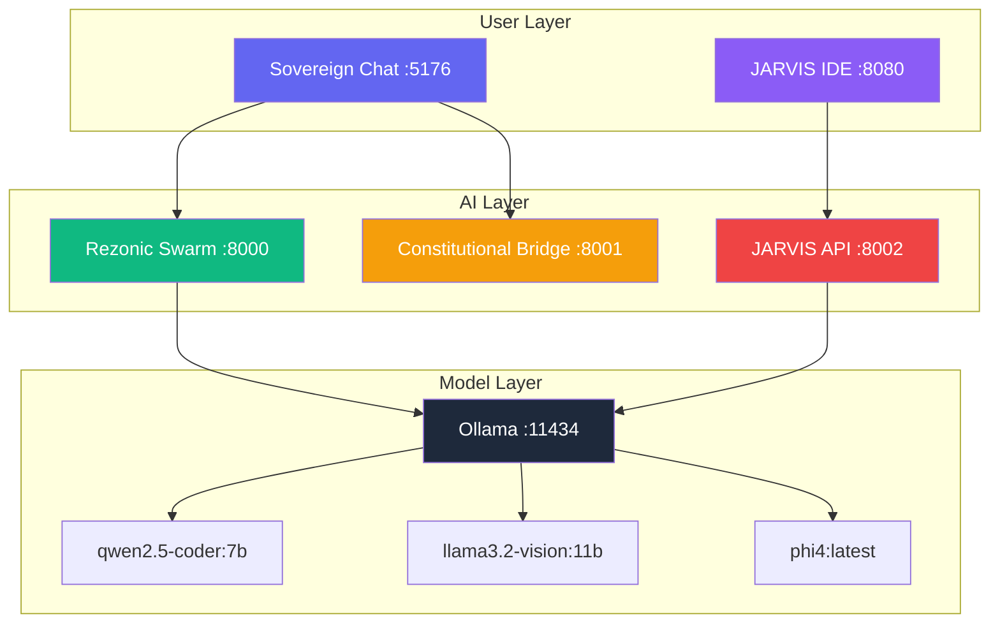

<div align="center">

# ?? ReZstack-zero-drift

**Sovereign AI Platform • Constitutional • Local • RTX 3060 Optimized**

[](LICENSE)
[](https://github.com/alchemyflownode/ReZstack-zero-drift/releases)
[](https://www.python.org)
[](https://nodejs.org)
[](https://www.nvidia.com)
[](CONTRIBUTING.md)

**Your complete, constitutional AI coworker. 100% local. Zero cloud. Zero API keys. Just your RTX 3060.**

[Key Features](#?-key-features) •
[Quick Start](#??-quick-start) •
[Architecture](#???-architecture) •
[Documentation](#??-documentation) •
[Contributing](#??-contributing)

</div>

---

## ? Key Features

<table>
<tr>
<td width="33%">
<h3>?? Constitutional AI</h3>
<ul>
<li>Zero-Drift Engine – immutable code laws</li>
<li>Auto-fixes any/unknown ? explicit types</li>
<li>Auto-fixes lodash/cloneDeep ? structuredClone</li>
<li>Auto-removes console.log in production</li>
<li>Vibe scoring (90/100 STABLE)</li>
</ul>
</td>
<td width="33%">
<h3>?? Smart Router</h3>
<ul>
<li>24 Ollama models, VRAM-aware scheduling</li>
<li>qwen2.5-coder:7b – production code generation</li>
<li>llama3.2-vision:11b – vision understanding ? verified</li>
<li>phi4:latest – complex reasoning</li>
<li>Automatic model selection by task</li>
</ul>
</td>
<td width="33%">
<h3>??? Security Auditing</h3>
<ul>
<li>JARVIS IDE – real vulnerability detection</li>
<li>Found 3 issues in self-scan (patched)</li>
<li>2 HIGH severity in agamoto-v8-sdk</li>
<li>1 CRITICAL in system files</li>
<li>Constitutional rules: 3 Active, 0 Violations</li>
</ul>
</td>
</tr>
<tr>
<td>
<h3>?? Sovereign Chat</h3>
<ul>
<li>Constitutional enforcement toggle</li>
<li>Real-time vibe scoring</li>
<li>24 models at your command</li>
<li>Vision prompt enhancement</li>
<li>Dark mode cyberpunk UI</li>
</ul>
</td>
<td>
<h3>?? Rezonic Swarm</h3>
<ul>
<li>Production FastAPI backend</li>
<li>OpenAPI 3.1 documentation</li>
<li>5 endpoints: chat, generate, agents, models, health</li>
<li>Sub-100ms validation latency</li>
<li>WebSocket ready</li>
</ul>
</td>
<td>
<h3>?? Zero-Drift Engine</h3>
<ul>
<li>Configuration stability guarantee</li>
<li>Audit trail for all validations</li>
<li>Self-curating code generation</li>
<li>Deterministic fixes</li>
<li>Vibe score analytics</li>
</ul>
</td>
</tr>
</table>

---

## ?? Quick Start

### Prerequisites

```
# Hardware
- NVIDIA RTX 3060 12GB (optimized) or compatible GPU
- 16GB+ RAM
- 20GB+ free storage

# Software
- Windows 10/11 (PowerShell 5.1+)
- Python 3.10+
- Node.js 18+
- Ollama
- Git
```

### 30-Second Installation

```powershell
# 1. Clone the repository
git clone https://github.com/alchemyflownode/ReZstack-zero-drift.git
cd ReZstack-zero-drift

# 2. Run the master controller
.\SOVEREIGN-AI-MASTER.ps1
```

**Your sovereign AI ecosystem will launch automatically:**

| Service | URL | Purpose |
|---------|-----|---------|
| **Sovereign Chat** | http://localhost:5176/chat | Constitutional AI coworker |
| **JARVIS IDE** | http://localhost:8080 | Security auditing |
| **Rezonic Swarm API** | http://localhost:8000/docs | AI backend |
| **Constitutional Bridge** | http://localhost:8001 | Zero-drift validation |

---

## ??? Architecture



---

## ?? Documentation

### Sovereign Chat API

```typescript
// Constitutional code generation
  body: JSON.stringify({
    prompt: "React component with TypeScript",
    language: "tsx",
    model: "qwen2.5-coder:7b"
  })
});
```
